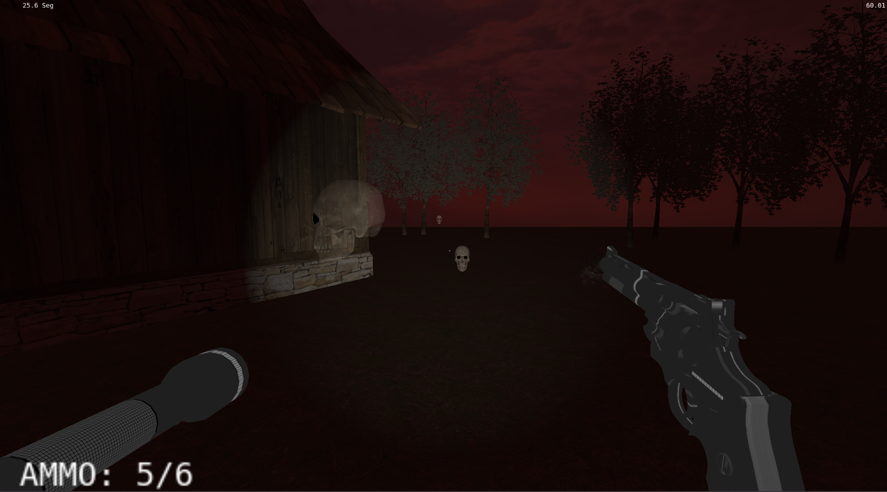
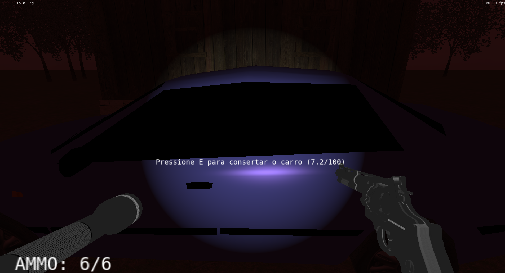

# A Floresta Amaldiçoada

## Descrição
-  Este jogo é o trabalho final para a cadeira de Fundamentos de Computação Gráfica, para o curso de graduação em Ciência da Computação, na UFRGS.
-  O nosso trabalho consistiu no desenvolvimento de um empolgante jogo em primeira pessoa (FPS) ambientado em uma cabana abandonada, no meio de um bosque. Neste jogo, o protagonista tem como missão principal consertar um carro para escapar da sinistra floresta, que é habitada por fantasmas amaldiçoados. O jogador deverá se defender utilizando um revolver e sua lanterna, que torna os monstros vulneráveis por conta da luz.

## Créditos & Menções
[Gabriel Carvalho Ávila]:
- Interpolação de Gouraud.
- Implementação de curvas de Beziér. 
- Implementação parcial da câmera look-at.
- Intersecção de objetos virtuais, incluindo colisões do tiro com os monstros, colisões do personagem com os monstros e colisões do personagem com o cenário.
- Instância de objetos como o monstro que fica rodeando a casa e instância das telas finais do jogo com mapeamento de textura.
- Contribuição para a lógica do jogo.

[José Henrique]:
- Implementação da iluminação.
- Implementação da câmera livre.
- Mapeamento de texturas, e mapas de textura complementar (normal-map, specular-map).
- Rendering dos objetos e animações.
- Contribuição para a lógica do jogo.

[Prof. Eduardo Gastal]:
- Definição do projeto.
- Apoio na aplicação dos conceitos estudados da cadeira.
- Fornecimento de materiais base para o desenvolvimento do código.

## Ferramentas e materiais utilizados
Este jogo foi desenvolvido em linguagem C++, utilizando bibliotecas OpenGL (glfw, glm).
Texturas e Objetos obtidos nos sites: 
- https://texturehaven.com/textures/
- https://hdrihaven.com/hdris/
- https://www.turbosquid.com/Search/3D-Models/free
Base do código fonte: Laboratórios da disciplina de Fundamentos em Computação Gráfica, ministrada pelo professor Eduardo Gastal.

Além destes, utilizou-se ChatGPT 3.5 para debugging de código. A ferramenta foi bastante útil para pequenas correções e para dicas de implementação de algumas funções da biblioteca que poderiam ser mais
fáceis.

## Processo de Desenvolvimento e conceitos de Computação Gráfica utilizados
O desenvolvimento do jogo utilizou vários conceitos de computação gráfica vistos em aula.

Houve a implementação da camera livre, que é usada na visão de primeira pessoa do personagem, também houve a implementação da camera look-at no menu inicial, onde há uma animação em que a camera fica girando em volta da casa e sempre olhando pro centro dela. 

Houve a implementação de várias malhas de polígonos complexas (malhas de triângulo), como por exemplo o carro, a cabine, o revolver, a lanterna, etc. Assim como a implementação das transformações geométricas (Translação, escalamento, projeção, rotação, etc) para que os objetos sigam a lógica do jogo corretamente. 

Também implementamos os testes de intersecções entre os objetos virtuais - intersecção cubo-cubo no caso da colisão dos monstros com o personagem, e também do tiro com os monstros; intesecção cubo-plano no caso do personagem com o chão; e intersecção ponto esfera no caso de algumas colisões com o cenário

Implementamos os modelos de iluminação de objetos geométricos vistos em aula, como o modelo de Lambert e Blinn-Phong que foram utilizados em quase todos os objetos da cena virtual, assim como a interpolação de Phong. A interpolação de Gouraud foi utilizada apenas no tiro da arma do personagem.

Mapemento de texturas: Todos os objetos tiveram mapeamento de textura, na maioria dos casos utilizando modelos de texturas pronto, definindo a cor final dos objetos

## Imagens

## Manual de Utilização
- Teclas W, A, S, D: movimentam o personagem pra frente, para a esquerda, para trás, pra direita respectivamente
- Visão do personagem: É controlada pela movimentação do mouse
- Botão esquerdo do mouse: Atira
- Tecla R: Recarrega a arma
- Tecla F: Desliga ou liga a lanterna
- Tecla ESC: Sai do jogo
- Tecla SPACE: Faz o personagem pular (ou começar o jogo se estiver no menu inicial)
- Tecla SHIFT: Faz o personagem andar mais rápido
- Tecla E: Conserta o carro se o personagem estiver próximo o suficiente
- Gameplay: O jogador tem 3 vidas no total, e o objetivo do jogo é consertar o carro totalmente. Cada vez que o algum monstro atinge o jogador, ele perde uma vida, se o jogador ficar sem vida ele perde e o jogo acaba. Se ele conseguir consertar o carro até o final, ele ganha e o jogo acaba =)

## Compilação e Execução
=== Windows
===================================
Para compilar e executar este projeto no Windows, baixe a IDE Code::Blocks em
http://codeblocks.org/ e abra o arquivo "Laboratorio_X.cbp".

**ATENÇÃO**: os "Build targets" padrões (Debug e Release) estão configurados
para Code::Blocks versão 20.03 ou superior, que utiliza MinGW 64-bits. Se você
estiver utilizando versões mais antigas do Code::Blocks (17.12 ou anteriores)
você precisa alterar o "Build target" para "Debug (CBlocks 17.12 32-bit)" ou
"Release (CBlocks 17.12 32-bit)" antes de compilar o projeto.

=== Linux
===================================
Para compilar e executar este projeto no Linux, primeiro você precisa instalar
as bibliotecas necessárias. Para tanto, execute o comando abaixo em um terminal.
Esse é normalmente suficiente em uma instalação de Linux Ubuntu:

    sudo apt-get install build-essential make libx11-dev libxrandr-dev \
                         libxinerama-dev libxcursor-dev libxcb1-dev libxext-dev \
                         libxrender-dev libxfixes-dev libxau-dev libxdmcp-dev

Se você usa Linux Mint, talvez seja necessário instalar mais algumas bibliotecas:

    sudo apt-get install libmesa-dev libxxf86vm-dev

Após a instalação das bibliotecas acima, você possui duas opções para compilação:
utilizar Code::Blocks ou Makefile.

--- Linux com Code::Blocks
-----------------------------------
Instale a IDE Code::Blocks (versão Linux em http://codeblocks.org/), abra o
arquivo "Laboratorio_X.cbp", e modifique o "Build target" de "Debug" para "Linux".

--- Linux com Makefile
-----------------------------------
Abra um terminal, navegue até a pasta "Laboratorio_0X_Codigo_Fonte", e execute
o comando "make" para compilar. Para executar o código compilado, execute o
comando "make run".

=== macOS
===================================
Para compilar e executar esse projeto no macOS, primeiro você precisa instalar o
HOMEBREW, um gerenciador de pacotes para facilitar a instação de bibliotecas. O
HOMEBREW pode ser instalado com o seguinte comando no terminal:

    /usr/bin/ruby -e "$(curl -fsSL https://raw.githubusercontent.com/Homebrew/install/master/install)"

Após a instalação do HOMEBREW, a biblioteca GLFW deve ser instalada. Isso pode
ser feito pelo terminal com o comando:

    brew install glfw

--- macOS com Makefile
-----------------------------------
Abra um terminal, navegue até a pasta "Laboratorio_0X_Codigo_Fonte", e execute
o comando "make -f Makefile.macOS" para compilar. Para executar o código
compilado, execute o comando "make -f Makefile.macOS run".

Observação: a versão atual da IDE Code::Blocks é bastante desatualizada pra o
macOS. A nota oficial dos desenvolvedores é: "Code::Blocks 17.12 for Mac is
currently not available due to the lack of Mac developers, or developers that
own a Mac. We could use an extra Mac developer (or two) to work on Mac
compatibility issues."

=== Soluções de Problemas
===================================

Caso você tenha problemas em executar o código deste projeto, tente atualizar o
driver da sua placa de vídeo.

--- Contribuições
-----------------------------------

Contribuições são bem-vindas! Sinta-se à vontade para corrigir bugs ou enviar solicitações de pull para melhorar o jogo.

